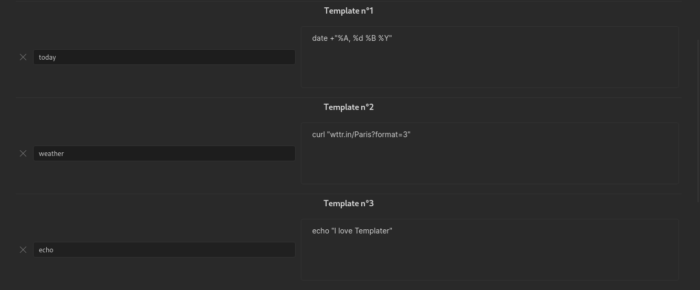

# 系统命令用户函数

这类用户函数允许你执行系统命令并获取其输出。

系统命令用户函数需要在 Templater 设置中开启。

## 定义系统命令用户函数

要定义一个新的系统命令用户函数，你需要指定一个 **函数名**，并将其关联到一个 **系统命令**。

操作方式：进入插件设置，点击 `Add User Function`。

完成后，[Templater](https://github.com/SilentVoid13/Templater) 会按你指定的名字创建一个用户函数，它会执行对应的系统命令并返回输出。

与内部函数一样，用户函数也挂在 `tp` JavaScript 对象下，更具体地说是 `tp.user` 对象下。

## 函数参数

你可以为用户函数传递可选参数。参数必须放在一个 JavaScript 对象里，以「属性: 值」的形式传入：`{arg1: value1, arg2: value2, ...}`。

这些参数会以[环境变量](https://en.wikipedia.org/wiki/Environment_variable)的形式供你的程序 / 脚本使用。

在前面的示例中，对应的命令声明为：`<% tp.user.echo({a: "value 1", b: "value 2"}) %>`。

如果系统命令调用的是 bash 脚本，可以通过 `$a` 和 `$b` 访问变量 `a` 和 `b`。

## 在系统命令中使用内部函数

你可以在系统命令中使用内部函数。内部函数会在系统命令执行前被替换掉。

例如，如果你把系统命令配置为 `cat <% tp.file.path() %>`，它在执行前会先被替换为 `cat /path/to/file`。
