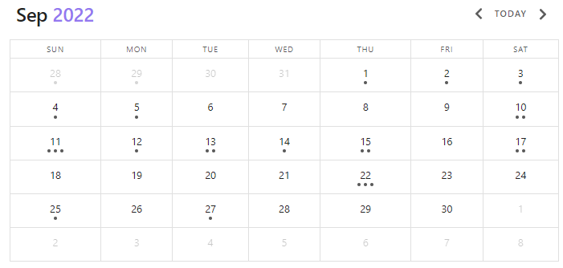

# 查询类型

**查询类型（Query Type）**决定了 Dataview 查询输出的呈现方式。它是你提供给 Dataview 查询的**第一个、也是唯一必需的**说明。可用的查询类型共有四种：`LIST`、`TABLE`、`TASK` 和 `CALENDAR`。

查询类型还决定了查询在哪个**信息层级**上执行。`LIST`、`TABLE` 和 `CALENDAR` 在**页面层级**上运作，而 `TASK` 查询则在 `file.tasks` 层级上运作。更多内容见 `TASK` 查询类型。

你可以将**任意查询类型与所有可用的[数据命令](data-commands.md)结合使用**，从而精炼你的结果集。关于查询类型与数据命令之间的关联，请参阅[如何使用 Dataview](../index.md#how-to-use-dataview) 以及 [结构页面](structure.md)。

!!! summary "查询类型"
    查询类型决定了查询的输出格式。它是查询中唯一必需的信息。

## LIST

`LIST` 查询会输出一个项目符号列表，列出文件链接；如果你选择[分组](data-commands.md#group-by)，则列出分组名称。你最多可以指定**一条附加信息**，与文件或分组信息一起输出。

!!! summary "`LIST` 查询类型"
    `LIST` 输出一个由页面链接或 Group 键组成的项目符号列表。你可以为每条结果指定一条附加信息。

最简单的 LIST 查询会输出 vault 中所有文件的项目符号列表：

~~~
```dataview
LIST
```
~~~

**输出**


- [Classic Cheesecake](#)
- [Git Basics](#)
- [How to fix Git Cheatsheet](#)
- [League of Legends](#)
- [Pillars of Eternity 2](#)
- [Stardew Valley](#)
- [Dashboard](#)


当然，你也可以使用[数据命令](data-commands.md)来限制要列出的页面：

~~~
```dataview
LIST
FROM #games/mobas OR #games/crpg
```
~~~

**输出**

- [League of Legends](#)
- [Pillars of Eternity 2](#)

### 输出附加信息

要为查询添加**附加信息**，请在 `LIST` 命令之后、可能存在的数据命令之前指定它：

~~~
```dataview
LIST file.folder
```
~~~

**输出**


- [Classic Cheesecake](#): Baking/Recipes
- [Git Basics](#): Coding
- [How to fix Git Cheatsheet](#): Coding/Cheatsheets
- [League of Legends](#): Games
- [Pillars of Eternity 2](#): Games
- [Stardew Valley](#): Games/finished
- [Dashboard](#):

你只能添加**一条**附加信息，不能多条。但是，你可以**指定一个计算值**来代替普通的元数据字段，这个计算值可以包含多个字段的信息：

~~~
```dataview
LIST "File Path: " + file.folder + " _(created: " + file.cday + ")_"
FROM "Games"
```
~~~

**输出**

- [League of Legends](#): File Path: Games _(created: May 13, 2021)_
- [Pillars of Eternity 2](#): File Path: Games _(created: February 02, 2022)_
- [Stardew Valley](#): File Path: Games/finished _(created: April 04, 2021)_

### 分组

默认情况下，**分组列表**只显示其分组键：

~~~
```dataview
LIST
GROUP BY type
```
~~~

**输出**

- game
- knowledge
- moc
- recipe
- summary

分组 `LIST` 查询的常见用法是将文件链接作为附加信息输出：

~~~
```dataview
LIST rows.file.link
GROUP BY type
```
~~~

- game:
    - [Stardew Valley](#)
    - [League of Legends](#)
    - [Pillars of Eternity 2](#)
- knowledge:
    - [Git Basics](#)
- moc:
    - [Dashboard](#)
- recipe:
    - [Classic Cheesecake](#)
- summary:
    - [How to fix Git Cheatsheet](#)

### LIST WITHOUT ID

如果你不希望在列表视图中包含文件名或分组键，可以使用 `LIST WITHOUT ID`。`LIST WITHOUT ID` 的用法与 `LIST` 相同，但当你添加了附加信息时，它不会输出文件链接或分组名称。

~~~
```dataview
LIST WITHOUT ID
```
~~~

**输出**


- [Classic Cheesecake](#)
- [Git Basics](#)
- [How to fix Git Cheatsheet](#)
- [League of Legends](#)
- [Pillars of Eternity 2](#)
- [Stardew Valley](#)
- [Dashboard](#)

它和 `LIST` 输出一致，因为这里没有附加信息！

~~~
```dataview
LIST WITHOUT ID type
```
~~~

**输出**

- moc
- recipe
- summary
- knowledge
- game
- game
- game

当你想要输出计算值时，`LIST WITHOUT ID` 会非常实用。

~~~
```dataview
LIST WITHOUT ID length(rows) + " pages of type " + key
GROUP BY type
```
~~~

**输出**

- 3 pages of type game
- 1 pages of type knowledge
- 1 pages of type moc
- 1 pages of type recipe
- 1 pages of type summary

## TABLE

`TABLE` 查询类型以表格视图输出页面数据。你可以通过**逗号分隔的列表**为 `TABLE` 添加零到多个元数据字段。作为列的不仅可以是普通的元数据字段，还可以是**计算式**。你还可以选择通过 `AS <header>` 语法指定**表格标题**。与所有其他查询类型一样，你可以使用[数据命令](data-commands.md)精炼查询的结果集。

!!! summary "`TABLE` 查询类型"
    `TABLE` 查询以表格视图渲染任意数量的元数据值或计算式。可以通过 `AS <header>` 指定列标题。

~~~
```dataview
TABLE
```
~~~

**输出**

| File (7) |
| ----- |
| [Classic Cheesecake](#) |
| [Git Basics](#) |
| [How to fix Git Cheatsheet](#) |
| [League of Legends](#) |
| [Pillars of Eternity 2](#) |
| [Stardew Valley](#) |
| [Dashboard](#) |

!!! hint "修改首列标题名"
    你可以在 Dataview 设置的 Table Settings -> Primary Column Name / Group Column Name 中修改首列标题的名称（默认为 "File" 或 "Group"）。
    如果你只想为某次具体的 `TABLE` 查询修改名称，请参考 `TABLE WITHOUT ID`。

!!! info "禁用结果计数"
    首列始终会显示结果数量。如果你不希望显示它，可以在 Dataview 的设置中禁用（"Display result count"，自 0.5.52 起可用）。

当然，`TABLE` 正是为指定一到多条附加信息而设计的：

~~~
```dataview
TABLE started, file.folder, file.etags
FROM #games
```
~~~

**输出**

| File (3) | started | file.folder | file.etags |
| --- | --- | --- | --- |
| [League of Legends](#)  | 	May 16, 2021 | 	Games	 | - #games/moba  |
| [Pillars of Eternity 2](#)  | 	April 21, 2022 | 	Games	 | - #games/crpg |
| [Stardew Valley](#) | 	April 04, 2021 | 	Games/finished	 |  - #games/simulation |

!!! hint "隐式字段"
    想了解 `file.folder` 和 `file.etags`？请参阅[页面上的隐式字段](../annotation/metadata-pages.md)。

### 自定义列标题

你可以使用 `AS` 语法为列指定**自定义标题**：

~~~
```dataview
TABLE started, file.folder AS Path, file.etags AS "File Tags"
FROM #games
```
~~~

**输出**

| File (3) | started | Path | File Tags |
| --- | --- | --- | --- |
| [League of Legends](#) | 	May 16, 2021 | 	Games	 | - #games/moba  |
| [Pillars of Eternity 2](#)  | 	April 21, 2022 | 	Games	 | - #games/crpg |
| [Stardew Valley](#) | 	April 04, 2021 | 	Games/finished	 |  - #games/simulation |

!!! info "包含空格的自定义标题"
    如果你想使用带空格的自定义标题（例如 `File Tags`），需要用双引号将其包裹：`"File Tags"`。

当你想将**计算式或表达式作为列值**时，这一点尤其有用：

~~~
```dataview
TABLE
default(finished, date(today)) - started AS "Played for",
file.folder AS Path,
file.etags AS "File Tags"
FROM #games
```
~~~

**输出**

| File (3) | Played for | Path | File Tags |
| --- | --- | --- | --- |
| [League of Legends](#) | 	1 years, 6 months, 1 weeks | 	Games	 | - #games/moba  |
| [Pillars of Eternity 2](#)  | 	7 months, 2 days | 	Games	 | - #games/crpg |
| [Stardew Valley](#) | 	4 months, 3 weeks, 3 days | 	Games/finished	 |  - #games/simulation |

!!! hint "计算式与表达式"
    关于计算表达式和计算式的更多能力，请参阅 [表达式](../reference/expressions.md) 与 [函数](../reference/functions.md)。

### TABLE WITHOUT ID

如果你不希望出现首列（默认为 "File" 或 "Group"），可以使用 `TABLE WITHOUT ID`。`TABLE WITHOUT ID` 的用法与 `TABLE` 相同，但当你添加附加信息时，它不会把文件链接或分组名称作为第一列输出。

例如，当你想输出另一个具有标识作用的值时，可以使用它：

~~~
```dataview
TABLE WITHOUT ID
steamid,
file.etags AS "File Tags"
FROM #games
```
~~~

**输出**

| steamid (3)  | File Tags |
| --- | --- |
| 560130 |  - #games/crog  |
| - |  - #games/moba |
| 413150 |   - #games/simulation |

此外，如果你想**为某次具体查询重命名首列**，也可以使用 `TABLE WITHOUT ID`。

~~~
```dataview
TABLE WITHOUT ID
file.link AS "Game",
file.etags AS "File Tags"
FROM #games
```
~~~

**输出**

| Game (3) | File Tags |
| --- | --- |
| [League of Legends](#) |  - #games/moba  |
| [Pillars of Eternity 2](#)  | - #games/crpg |
| [Stardew Valley](#) |  - #games/simulation |

!!! info "通用方式重命名首列"
    如果你想在所有情况下都重命名首列，请在 Dataview 设置的 Table Settings 下修改名称。

## TASK

`TASK` 查询输出**vault 中所有匹配给定[数据命令](data-commands.md)（如果有的话）的任务的交互式列表**。与其他查询类型相比，`TASK` 查询的特殊之处在于它返回**任务（Task）作为结果，而不是页面**。这意味着所有[数据命令](data-commands.md)都在**任务层级**上运作，从而让你能够基于任务的状态或任务自身的元数据对任务进行精细过滤。

此外，`TASK` 查询是**通过 DQL 修改文件**的唯一途径。通常 Dataview 不会触碰你的文件内容；但是，如果你在 Dataview 查询中勾选了某个任务，那么它**也会在其原始文件中被勾选**。在 Dataview 设置的 "Task Settings" 中，你可以选择在 Dataview 中勾选任务时自动设置一个 `completion` 元数据字段。但请注意，这只有当你在 dataview 块内勾选任务时才有效。

!!! summary "`TASK` 查询类型"
    `TASK` 查询渲染一个包含 vault 中所有任务的交互式列表。`TASK` 查询在**任务层级**而非页面层级上执行，因此可以进行针对任务的过滤。这是 Dataview 中唯一一个在被交互时会修改原始文件的命令。

~~~
```dataview
TASK
```
~~~

**输出**

- [ ] Buy new shoes #shopping
- [ ] Mail Paul about training schedule
- [ ] Finish the math assignment
    - [x] Finish Paper 1 [due:: 2022-08-13]
    - [ ] Read again through chapter 3 [due:: 2022-09-01]
    - [x] Write a cheatsheet [due:: 2022-08-02]
    - [ ] Write a summary of chapter 1-4 [due:: 2022-09-12]
- [x] Hand in physics
- [ ] Get new pillows for mom #shopping
- [x] Buy some working pencils #shopping

你可以像使用其他所有查询类型一样使用[数据命令](data-commands.md)。数据命令在任务层级执行，因此可以直接使用[任务上的隐式字段](../annotation/metadata-tasks.md)。

~~~
```dataview
TASK
WHERE !completed AND contains(tags, "#shopping")
```
~~~

**输出**

- [ ] Buy new shoes #shopping
- [ ] Get new pillows for mom #shopping

任务查询的一个常见用法是**按其来源文件对任务进行分组**：

~~~
```dataview
TASK
WHERE !completed
GROUP BY file.link
```
~~~

**输出**

[2022-07-30](#) (1)

- [ ] Finish the math assignment
    - [ ] Read again through chapter 3 [due:: 2022-09-01]
    - [ ] Write a summary of chapter 1-4 [due:: 2022-09-12]

[2022-09-21](#) (2)

- [ ] Buy new shoes #shopping
- [ ] Mail Paul about training schedule

[2022-09-27](#) (1)

- [ ] Get new pillows for mom #shopping

!!! hint "对带有子任务的任务计数"
    注意到 `2022-07-30` 标题上的 (1) 了吗？子任务归属于其父任务，不会单独计数。此外，它们在过滤时**行为也有所不同**。

### 子任务

如果一个任务**以一个制表符缩进**，并且位于一个未缩进的任务之下，那么它就被视为**子任务**。

- [ ] clean up the house
	- [ ] kitchen
	- [x] living room
	- [ ] Bedroom [urgent:: true]


!!! info "项目符号列表项的子项"
    严格来说，缩进在项目符号列表项下的任务也是子任务，但在大多数情况下 Dataview 会把它们当作普通任务处理。

子任务**归属于其父任务**。这意味着当你查询任务时，子任务会作为父任务的一部分被返回。

~~~
```dataview
TASK
```
~~~

**输出**

- [ ] clean up the house
	- [ ] kitchen
	- [x] living room
	- [ ] Bedroom [urgent:: true]
- [ ] Call the insurance about the car
- [x] Find out the transaction number

这具体意味着：只要父任务匹配查询，子任务就会成为结果集的一部分——即使子任务自身并不匹配。

~~~
```dataview
TASK
WHERE !completed
```
~~~

**输出**

- [ ] clean up the house
	- [ ] kitchen
	- [x] living room
	- [ ] Bedroom [urgent:: true]
- [ ] Call the insurance about the car

这里 `living room` **并不匹配**查询，但它仍被包含在内，因为其父任务 `clean up the house` 匹配。

请注意，如果子任务匹配谓词而父任务不匹配，你会单独得到这个子任务：

~~~
```dataview
TASK
WHERE urgent
```
~~~

**输出**

- [ ] Bedroom [urgent:: true]

## CALENDAR

`CALENDAR` 查询输出一个按月的日历视图，其中每个结果都会作为对应日期上的一个圆点。`CALENDAR` 是唯一需要附加信息的查询类型。这个附加信息必须是所有被查询页面上的一个[日期](../annotation/types-of-metadata.md#date)（或未设置）。

!!! summary "`CALENDAR` 查询类型"
    `CALENDAR` 查询类型渲染一个日历视图，其中每个结果都以圆点的形式呈现在给定的元数据字段日期上。


~~~
```dataview
CALENDAR file.ctime
```
~~~

**输出**



虽然可以将 `SORT` 和 `GROUP BY` 与 `CALENDAR` 组合使用，但它们**没有任何效果**。此外，如果给定的元数据字段包含的不是有效的[日期](../annotation/types-of-metadata.md#date)，日历查询将不会渲染（但字段可以为空）。为确保只纳入有效的页面，你可以对有效的元数据值进行过滤：

~~~
```dataview
CALENDAR due
WHERE typeof(due) = "date"
```
~~~
