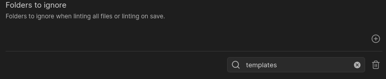
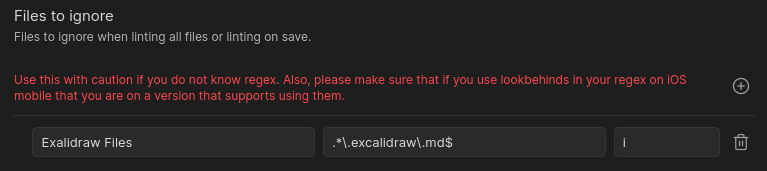

# 忽略或禁用规则

在 Linter 中有几种方式可以忽略规则。从插件本身的设置，到 YAML frontmatter 中的值，再到用于忽略文件某一部分或整个文件的语法，应有尽有。

## 忽略文件夹

插件中有一个名为 `Folders to Ignore` 的设置。顾名思义，这个设置用于让用户指定不希望被 lint 规则影响的文件夹。文本框中的值应是从 Obsidian 仓库根目录算起的文件夹路径。



例如，在上图中，当 Linter 尝试运行其规则时，`templates` 文件夹会被忽略，其嵌套的子文件夹也会一并被忽略。

## 通过正则表达式忽略文件

本插件提供了一项设置，允许你通过提供正则表达式来匹配并忽略文件。如果某个文件匹配了所提供的正则表达式，Linter 会在对它 lint 之前就将其忽略。



例如，在上图中可以看到，以 `.exclidraw.md` 结尾的 Excalidraw 文件被通过正则表达式 `.*\.excalidraw\.md$` 忽略。

## 针对特定文件禁用规则

有时候，你可能需要为某个特定文件禁用一条或多条规则，但又不想忽略该文件所在文件夹下的所有文件。这种情况下，可以通过 YAML frontmatter 或范围忽略来禁用某条或某些规则。

### YAML Frontmatter

在文件的 YAML frontmatter 中，可以使用键 `disabled rules` 指定一个要为该文件禁用的规则列表。要禁用的规则，有效值为具体规则的别名，或用 `all` 来禁用该文件的全部规则。

例如，下面的写法会在其所在的整个文件中禁用 [capitalize headings](../settings/heading-rules.md#capitalize-headings) 和 [header increment](../settings/heading-rules.md#header-increment)：
``` markdown
---
disabled rules: [capitalize-headings, header-increment]
---
```

下面的写法会禁用某个文件的全部 Linter 规则：
``` markdown
---
disabled rules: [all]
---
```

### 范围忽略

当你需要为文件的某一部分禁用 Linter 时，可以使用范围忽略。范围忽略的语法是 `<!-- linter-disable -->` 或 `%%linter-disable%%`，并可选地在希望 Linter 恢复 lint 的位置使用 `<!-- linter-enable -->` 或 `%%linter-disable%%`。如果省略范围忽略的结束标记，则 Linter 会认为你希望从范围忽略的起点一直忽略到文件末尾。因此，未结束的范围忽略请务必小心。

!!! warning
    范围忽略只防止范围忽略区间内的内容被 lint。它*不会*防止在范围忽略标记周围出现的空格或其他添加内容被处理。

下面的示例展示了如何只忽略文件的某一部分：
``` markdown
Here is some text
<!-- linter-disable -->
                          This area will not be formatted
<!-- linter-enable -->
More content goes here...
%%linter-disable %%
                          This area will not be formatted
%%linter-enable%%
```

下面是另一个示例，展示了一个没有结束标记的范围忽略：
``` markdown
Here is some text
<!-- linter-disable -->
                          This area will not be formatted
This content is also not formatted either.
```

!!! info
    粘贴规则不受范围忽略的影响，因为那将要求被复制的文本自身包含范围忽略标记。
