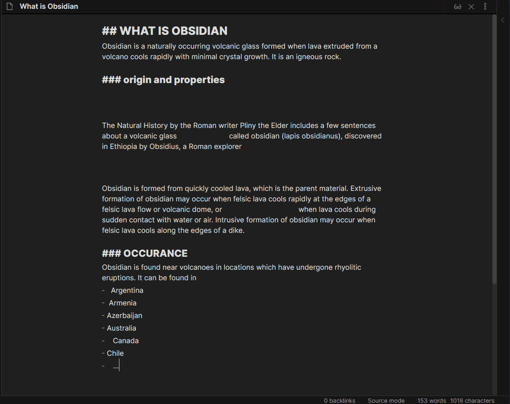
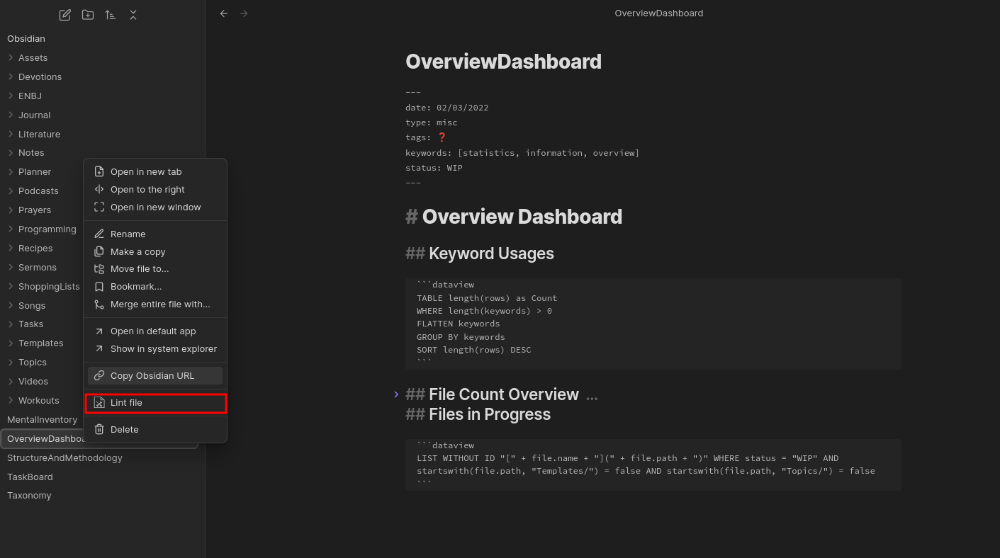
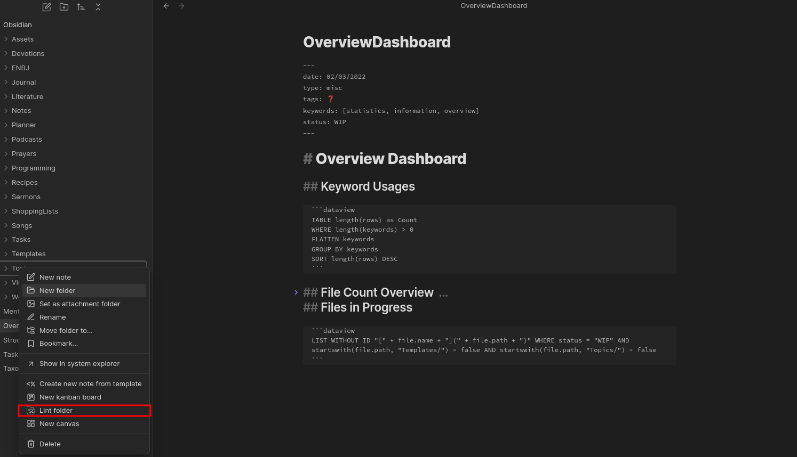

# 用法

你可以通过多种不同的方式来运行 Linter。

## 保存时运行

本插件提供一个选项：在你通过 `Ctrl+S`（或使用 vim 键位绑定时的 `:w`）保存文件时，对当前文件进行 lint。你需要打开 `Lint on save` 设置才能使用此功能。

启用此设置后，你就不用每次想对当前文件 lint 时都手动运行 Obsidian 命令了。

## 文件关闭或切换时运行

还有一个选项：当用户关闭某个文件或切换到另一个文件时，对该文件进行 lint。要启用此功能，你需要打开 `Lint on File Change` 设置。

在你忘记在切换到新文件或关闭当前文件之前先运行 Linter 时，这种 lint 方式可以帮上忙。

## Obsidian 命令

| Obsidian 命令 | 说明 | 默认快捷键 |
| ---------------- | ----------- | ------------------ |
| `Lint the current file` | 对当前文件运行 Linter 规则 | `Ctrl+Alt+L` |
| `Lint all files in the vault` | 对仓库中的所有文件运行 Linter 规则 | N/A |
| `Lint all files in the current folder` | 对当前文件夹及其子文件夹下的所有文件运行 Linter | N/A |

下面是通过 Obsidian 命令对当前文件 lint 的示例：

## 文件菜单操作项

你也可以在文件菜单中右键点击文件或文件夹，再选择对应的下拉选项来对它们进行 lint。

下面是文件菜单中 "lint 文件" 操作项的样子：

下面是文件菜单中 "lint 文件夹" 操作项的样子：

